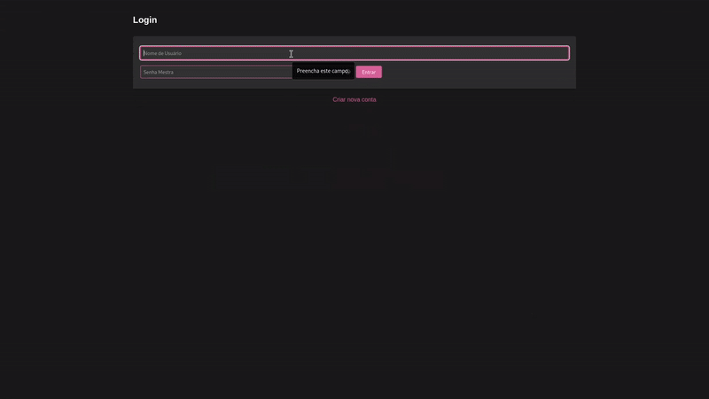

# MyPasses - Gerenciador de Senhas Self-Hosted

MyPasses é um gerenciador de senhas seguro e self-hosted desenvolvido em Python, focado em privacidade e segurança dos dados.



## Principais Funcionalidades

- Criptografia forte usando Fernet (symmetric encryption)
- Geração de senhas aleatórias seguras
- Verificação de senhas vazadas via API HaveIBeenPwned
- Monitoramento de vazamentos de dados usando Inteligência Artificial
- Sistema de autenticação com senha mestra
- Interface web responsiva e intuitiva
- Gerenciamento completo de senhas (adicionar, editar, excluir)
- Timeout de sessão automático
- Proteção CSRF
- Rate limiting para tentativas de login

## Tecnologias Utilizadas

### Backend
- Python 3
- Flask (Framework Web)
- Cryptography (Criptografia)
- CrewAI (Análise de Segurança)
- DuckDuckGo API (Pesquisa)
- HaveIBeenPwned API (Verificação de Vazamentos)

### Frontend
- HTML5
- CSS3
- JavaScript
- Font Awesome (Ícones)

### Segurança
- PBKDF2 (Key Derivation)
- SHA-256 (Hashing)
- Salt único por senha
- CSRF Protection
- Rate Limiting
- Secure Session Management

## Recursos de Segurança

- Criptografia de ponta a ponta
- Verificação de senhas comprometidas
- Monitoramento contínuo de vazamentos
- Alertas de segurança em tempo real
- Timeout automático de sessão
- Proteção contra força bruta
- Armazenamento seguro de senhas mestras

## Funcionalidades do Dashboard

- Visualização de todas as senhas salvas
- Sistema de busca e filtragem
- Indicadores visuais de senhas comprometidas
- Geração de senhas fortes
- Copiar senhas com um clique
- Edição rápida de credenciais
- Notas seguras por entrada

## Como Executar

### Pré-requisitos
- Python 3.11
- pip (Python package manager)

### Instalação
```bash
git clone https://github.com/IgorCoraine/MyPasses.git
```

```bash
cd MyPasses
```
```bash
python -m venv venv
```
```bash
source venv/bin/activate #linux
source venv/Scripts/activate #windows
```
```bash
pip install -r requirements.txt
```

### Configuração
1. Crie um arquivo `.env` na raiz do projeto
2. Adicione as seguintes variáveis:
```env
OPENAI_API_KEY=your_openai_api_key
MASTER_PASSWORD_FILE=your_master_password_file.bin
PASSWORDS_FILE=your_passwords_file.bin
URLS_MONITOR_FILE=your_urls_monitor_file.txt
SESSION_TIMEOUT=your_session_timeout_in_seconds
```

### Executando
```bash
python app.py
```

Acesse `http://localhost:5000` no seu navegador
